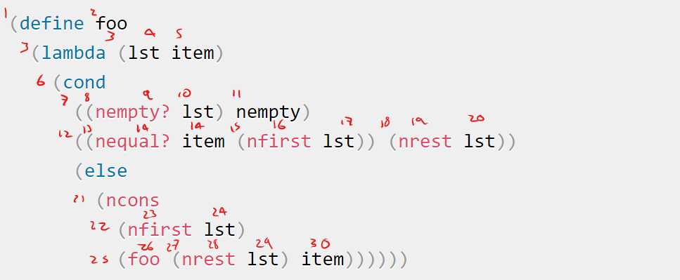
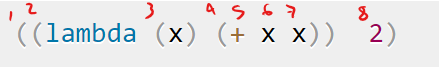

# Lenguajes de Programación - Examen 3

# Integrantes 

| **Nombre** | **No. de cuenta** |
|---|---|
| *Cureño Sánchez Misael* | 418002485 |

<br>

---

<br>

## Ejercicios

<br>

1. Del siguiente codigo en Racket:

    
    ```scheme
    (define (filter-neg l)
      (cond
        ((nempty? l) empty)
        (else
          (if (< (nfirst l) 0)
            (cons 
              (nfirst l) 
              (filter-neg (nrest l)))
            (filter-neg (nrest l))))))
    ```

    <br>

    - Convierte el codigo anterior a CPS.
      
      **Respuesta**: <br>

      ```scheme
      ; Función auxiliar para insertar un 
      ; elemento e al final de la lista l
      (define (snoc e l)
        (append l (list e)))

      (define (filter-neg-cps l k)
            (cond
              [(nempty? l) (k '())]
              [else
                (if (< (nfirst l) 0)
                  (filter-neg-cps
                    (nrest l)
                    (λ (x)
                      (snoc (nfirst l) (k x))))
                  (filter-neg-cps (nrest l) k))]))

      (filter-neg '(0 1 -1 0 -4 1 -2))
      (filter-neg-cps '(0 1 -1 0 -4 1 -2) (λ (x) x))
      ```


    <br>

    - ¿Que regresa la función que convertiste a CPS cuando recibe la lista `'(0 1 -1 0 -4 1 -2)`?

      **Respuesta**: <br>

      ```scheme
      '(-1 -4 -2)
      ```

    <br>

2. Da la expresión asociada a la continuacion y el resultado de dicha expresión,
para cada uno de los siguientes codigos:
    <br>

    - **Respuesta**: <br>

        ```scheme
        (- 
          (+ 5 (call/cc
            (lambda (k)
              (begin
                (set! *k* k)
                (k (* 6 3))))))
          12)
        ```

    <br>

    - **Respuesta**: <br>
      
        ```scheme
        (*k* (* 3 4))
        ```

    <br>

3. Explica al menos dos ventajas de cada uno de los tipos de polimorfismo vistos en clase
y da ejemplos de cada uno de ellos.

    **Respuesta**: <br>
  
    1. Polimorfismo explicito

        - No da lugar a confusión respecto a qué se utilizando en que cosa,
        cuando un programador lee el codigo.
        - Puede llegar a facilitar la depuración a largo plazo.

    <br>

    2. Polimorfismo implicito
    
        - No es necesario hacer la definición o sobrecarga de las funciones.
        - El codigo se simplifica pues podemos aplicar una misma funcion a varios tipos

    <br>

4. Para los términos siguientes en el lenguaje usado en clase da la prueba formal
de la preservacion de sus tipos:

    - Expresión condicional if (usando el comportamiento del *if* de *Haskell*). <br>

      **Respuesta**: <br>

        ```ocaml
        {if condition 
          then
          else}

        (* Como el comportamiento es el mismo de Haskell, unicamente podemos
        devolver el mismo tipo en cualquiera de las ramas de la expresión
        if, de modo que: *)
        ```

        <br>

    - Expresión aplicación de función (f a). <br>
    
      **Respuesta**: <br>


        ```ocaml
        {f a}
        ```

  <br>

5. Da la demostracion del *Teorema de Progreso* para los términos siguientes
en el lenguaje usado en clase:

    **Respuesta**: <br>

    - Expresión suma

        ```ocaml
        {+ a b}
        ```
  
  <br>

6. Da el juicio de tipo para la siguiente expresión.

    ```ocaml
    {with {x 2} {
        {fun {y} {if true 0 {+ y x}}}
        3}}

        Γ ⊢ e1 : T1     Γ, x : T1 ⊢ e2 : T2
        ----------------------------------
        Γ ⊢ (with (x e1) e2) : T2
    ```

    **Respuesta**: <br>


    ```
                                                          ------------              -------------
                                                          Γ y : number              Γ x : number
                      ---------------                     ---------------------------------------
                      Γ ⊢ 0 : number                      Γ ⊢ {+ y x} : number, number -> number
                      ---------------------------------------------------------------------------
                      Γ ⊢ {λ {y} {if true 0 {+ y x}}} : number -> T = number      Γ ⊢ 3 : number
    --------------    ---------------------------------------------------------------------------
    Γ ⊢ 2 : number     Γ x : T1 ⊢ {{λ {y} {if true 0 {+ y x}}} 3} : T = number
    ---------------------------------------------------------------------------
    Γ ⊢ {with {x 2} {{λ {y} {if true 0 {+ y x}}} 3} : T = number
    ```

  <br>

7. Realiza la *inferencia de tipos* de la siguiente expresión, mencionando al 
termino de la inferencia, los tipos de cada una de las variables de la función.

    ```scheme
    (define foo
      (lambda (lst item)
        (cond
          ((nempty? lst) nempty)
          ((nequal? item (nfirst lst)) (nrest lst))
          (else 
            (ncons 
              (nfirst lst) 
              (foo (nrest lst) item))))))
    ```

    
    **Respuesta**:

    *Paso 1*: Enumeramos cada subexpresión
    
    <br>
    <center>
    
    </center>
    <br>

    *Paso 2*: Generamos las restricciones

    $[[\fbox{1}]] = [[\fbox{4}]] $ <br><br>
    $[[\fbox{2}]] = [[\fbox{3}]] \rightarrow [[\fbox{4}]]$ <br><br>
    $[[\fbox{3}]] = [[\fbox{6}]] = [[\fbox{7}]]$ <br><br>
    $[[\fbox{5}]] = [[\fbox{6}]] \times [[\fbox{7}]]  \rightarrow [[\fbox{4}]]$ <br><br>
    $[[\fbox{7}]] = number $ <br><br>
    $[[\fbox{8}]] = number $ <br><br>


8. Utiliza el algoritmo de unificacion visto en clase en la expresión:

    ```scheme
    ((lambda (x) (+ x x))  2)
    ```

    **Respuesta**:

    *Paso 1*: Enumeramos cada subexpresión
    
    <br>
    <center>
    
    </center>
    <br>

    *Paso 2*: Generamos las restricciones

    $[[\fbox{1}]] = [[\fbox{4}]] $ <br><br>
    $[[\fbox{2}]] = [[\fbox{3}]] \rightarrow [[\fbox{4}]]$ <br><br>
    $[[\fbox{3}]] = [[\fbox{6}]] = [[\fbox{7}]]$ <br><br>
    $[[\fbox{5}]] = [[\fbox{6}]] \times [[\fbox{7}]]  \rightarrow [[\fbox{4}]]$ <br><br>
    $[[\fbox{7}]] = number $ <br><br>
    $[[\fbox{8}]] = number $ <br><br>

    *Paso 3*: Algoritmo de únificación.

    <center>
      <table width="100%">
      <tr>
        <th>Acción</th>
        <th>Stack</th>
        <th>Sustituciones</th>
      </tr>
      
      <tr>
      <td>
        1
      </td>
      <td  width="50%">
        $[[\fbox{1}]]$
      </td>
      <td>

      </td>
      <br>
      </tr>

      </table>
    </center>

9. Da las sentencias de variables de tipo para las siguientes funciones de Racket:

    - `empty?` (recibe una lista y si es la lista vacía regresa el valor booleano de *true* y *false* en otro caso).

        **Respuesta**: <br>


    <br>

    - `filter-neg` (recibe una lista de numeros enteros y regresa la lista solo con los enteros negativos).
    
        **Respuesta**: <br>


  <br>

10. Modifica la siguiente expresión utilizando el Combinador de Punto Fijo Y:

    ```scheme
    (let (
      [f (lambda (n) 
            (if (zero? (modulo n 2))
              #t
              (f (- n 1))))])
      (f 3))
    ```

    
    **Respuesta**: <br>

    ```scheme
    (let* ([
            Y (λ (f)
                (
                  (λ (x) (f (x x)))
                  (λ (x) (f (x x)))))],
            [f (Y (lambda (n) 
                    (if (zero? (modulo n 2))
                      #t
                      (f (- n 1)))))])
       
      (f 3))
    ```


<script type="text/javascript" src="http://cdn.mathjax.org/mathjax/latest/MathJax.js?config=TeX-AMS-MML_HTMLorMML"></script>
<script type="text/x-mathjax-config">
  MathJax.Hub.Config({ tex2jax: {inlineMath: [['$', '$']]}, messageStyle: "none" });
</script>