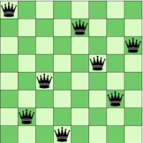
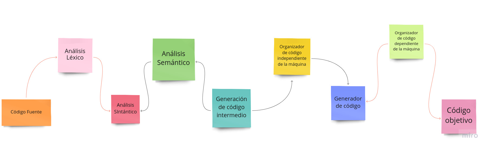

# Lenguajes de Programación - Tarea 1

# Integrantes 

| **Nombre**  | **No. de cuenta**  |
|---|---|
|  *Cureño Sánchez Misael* |  418002485 |
|  *González Mancera Ivette* |  316014490 |

<br>

---

<br>

## Ejercicios

<br>

1. Elige 4 lenguajes de programación (uno por cada paradigma), e indica para cada uno de ellos el año de creación, paradigma al que pertenece y principales caracteristicas.

    - **C**: Apareció en 1972, se trata de un lenguaje procedural de proposito general, cuenta con tipos de dato estáticos, es debilmente tipado, permite un acceso tanto de alto como de bajo nivel (especialmente util para acceder directamente a memoria o a dispositivos perifericos) 

    - **Java**: Apareció en 1996, es el lenguaje orientado a objetos por excelencia. Sus principales caracteristicas son: portabilidad, tipado fuerte, es un lenguaje que se compila a un tipo particular de código máquina conocido como bytecode, el cuál es luego interpretado por una máquina virtual.

    - **Clojure**: Apareció en 2007, pertenece al paradigma funcional aunque integra elementos de otros paradigmas. Particularmente pensado para trabajar con programación concurrente. Clojure puede ser ejecutado en la maquina virtual de Java.

    - **Prolog**: Fue creado en 1972, pertenece al paradigma lógico, las principales caracteristicas es el uso de hechos y reglas, además es un lenguaje interpretado y es ampliamente utilizado en el contexto de la inteligencia artificial.
    

    <br>
    
2. *LISP* es considerado el primer lenguaje de programación funcional. Y esta basado en el *Cálculo λ* que fue
desarrollado por **Alonzo Church**.

    - Investiga y explica brevemente qué elementos del cálculo lambda están presentes en *LISP*, e indica por qué crees que pueden usarse en un lenguaje de programación.

            El cálculo lambda (cálculo-λ) fue introducido por Alonzo Church en su artículo: «An un-solvable problem of elementary number theory» (Church, 1936) en la década de 1930.

            Años después, en la década de 1950 John Mc-Carthy crearía Lisp que es uno de los primeros lenguajes de programación. Es así, como nace el paradigma de programación funcional que trabaja con máquinas de reducción. 

            El cálculo lambda es una notación formal que permite expresar funciones computables. El cual es el fundamento de la programación funcional. Se define con la letra Griega lambda (λ) y se expresa a través de expresiones lambda, y términos lambda que son usados para representar binding variables dentro de una función.

            El cálculo lambda a diferencia con las funciones matemáticas trata con funciones anónimas, es decir, no existe la necesidad de asignarle un nombre explícito a una función.

            La función se puede evaluar usando aplicación de funciones. Hace referencia a aplicar un
            conjunto de argumentos desde el dominio para obtener el valor a devolver desde el codominio, en término de programación se diría ejecutar una función.


    - Menciona cuáles de estos elementos están presentes en el lenguaje de programación *Java*. ¿Acaso estos
elementos estaban en las primeras versiones del lenguaje? De no ser así ¿porqué crees que fueron añadidos?

            Una expresión lambda es un tipo de función. Puede considerarse como un método Java ordinario pero con la capacidad distintiva de pasarse a otros métodos como argumento.

            Así es. ¡Se ha vuelto posible pasar no solo números, cadenas y gatos a métodos, sino también otros métodos!

            ¿Cuándo podríamos necesitar esto? Sería útil, por ejemplo, si queremos pasar algún método de devolución de llamadas. Es decir, si necesitamos que el método que llamamos tenga la capacidad de llamar a algún otro método que le pasemos. En otras palabras, tenemos la capacidad de pasar una devolución de llamada en ciertas circunstancias y una devolución de llamada diferente en otras. Y para que nuestro método que recibe nuestras devoluciones de llamada las llame.


3. Describe las principales características de los distintos paradigmas de programación (Imperativo, Orientado a
Objetos, Funcional y Lógico) y da 2 ejemplos de lenguajes de programación de cada paradigma.

    - **Paradigma procedural**: La programación estructurada es una forma de escribir programas de computadora utilizando ciertas instrucciones de control (bucles y condicionales), se describe paso a paso un conjunto de instrucciones que deben ejecutarse para variar el estado del programa y hallar la solución, es decir, se emplea un algoritmo que describe los pasos necesarios para solucionar el problema.

        Ventajas:

        - La programación estructurada se caracteriza por tener lenguajes sencillos de comprender para una persona con basto conocimiento ya que se puede leer de secuencia por ello se considera semi-natural.
        - La lógica que se emplea en este tipo de programación es más visible lo que facilita las pruebas de escritorio y la corrección de errores.
        
        <br>

        Desventajas:
            
        - El principal inconveniente de este método de programación, es que se obtiene un único bloque de programa, que cuando se hace demasiado grande puede resultar problemático su manejo.
        
        <br>

        Ejemplos de lenguajes:

        - C
        - Fortran
        - Pascal 

        <br>

    - **Paradigma orientado a objetos**: El comportamiento del programa es llevado a cabo por objetos, entidades que representan elementos del problema a resolver y tienen atributos y comportamiento.

        Ventajas:

        - La facilidad de reutilización de código en diferentes proyectos.
        - La facilidad de añadir, suprimir o modificar nuevos objetos nos permite hacer modificaciones de una forma muy sencilla.
        - Debido a las sencillez para abstraer el problema, los programas orientados a objetos son más sencillos de leer y comprender.
        
        <br>

        Desventajas:
            
        - Complejidad para adaptarse
        - La necesidad de utilizar bibliotecas de clases obliga a su aprendizaje y entrenamiento.
        
        <br>

        Ejemplos de lenguajes:

        - Java
        - C++
        - Ruby
        
        <br>

    - **Paradigma funcional**: El paradigma funcional considera al programa como una función matemática, donde el dominio representaría el conjunto de todas las entradas posibles ( inputs ) y el rango sería el conjunto de todas las salidas posibles (outputs).

        Ventajas:

        - Más fáciles de escribir y depurar. 
        - Uso de arquitecturas paralelas.

        <br>

        Desventajas:

        - Carecen de librerías, interfaces con otros lenguajes y herramientas de depuración.
        - Al no utilizar sentencias, no existen asignaciones, por lo que una vez que las variables asumen un valor, no cambian durante la ejecución.
        - Modelo alejado de Von Neuman.

        <br>

        Ejemplos de lenguajes:

        - Scheme
        - Lisp
        - SAP

        <br>


    - **Paradigma lógico**: La Programación Lógica estudia el uso de la lógica para el planteamiento de problemas y el control sobre las reglas de inferencia para alcanzar la solución automática. Basado en la lógica de predicados.

        Ventajas:

        - Permite visualizar gráficamente el camino que sigue la solución a un problema.
        - No se necesitan muchos conocimientos técnicos para utilizar esta técnica.

        <br>

        Desventajas:

        - Dado que los flujos (representados con flechas) pueden ir de cualquier lugar a cualquier lugar da espacio para que el diagrama llegue a ser casi inentendible.
        - Los ciclos deben ser reinterpretados para poder ser diagramados en esta técnica
        - Algunas veces la analogía entre el diagrama y la codificación en el lenguaje de programación resulta ser compleja.

        <br>

        Ejemplos de lenguajes:

        -  Prolog
        - ALF
        - Gödel

        <br>

4. ¿Cuál de los paradigmas de lenguajes de programación, es el más adecuado para resolver los siguientes
problemas? Justifica en cada caso.

    - Se requiere desarrollar un sistema que simule un modelo de sociedad de organización de termitas. Este sistema se compone, de manera general de: un espacio que las termitas recorrerán y en el cuál se encuentran astillas esparcidas, las termitas siguen las siguientes reglas de comportamiento.

        - Caminan aleatoriamente hasta encontrar una astilla.
        - Si la termita se encuentra cargando una astilla, la suelta y continua caminando aleatoriamente.
        - Si la termita no está cargando una astilla la toma y continúa caminado aleatoriamente con la astilla

    <br/>

    **Respuesta**: 

        Dado que queremos representar entidades, que pueden guardar un estado interno, así como una compleja interacción entre las mismas, lo mas apropiado sería utilizar un enfoque orientado a objetos. De esta manera podemos modelar las entidades y sus comportamientos más facilmente.

    - El Problema de las Ocho Reinas consiste en acomodar ocho reinas de ajedrez en un tablero, sin que ninguna de éstas se ataque entre sí. Una reina, puede atacar (a) de forma vertical, (b) de forma horizontal y (c) en diagonal. Usando estas reglas, indicar si el siguiente tablero es una solución al problema de las ocho reinas.

    <br/>

    <center>
        <br>
    </center>

    **Respuesta**: 

        Dado que únicamente queremos verificar si la entrada al programa es una solucion al problema especificado, trabajar con hechos es mucho más util y eficiente en este caso, por lo que el enfoque lógico resultaría lo más conveniente.

    - Escribir un programa que indique si un número natural es primo.

    <br/>

    **Respuesta**: 

        Lo más conveniente sería usar un enfoque funcional, pues el codigo resultante es mucho más explicito además las pruebas del mismo resultan mucho más faciles de elaborar, además la reutilizacion de la funcion definida se vuelve mucho más facil que en otros paradigmas.


    - Dado un archivo con los primeros 10,000 dígitos de π, contar todas las apariciones de números primos presentes en él.

    <br/>

    **Respuesta**: 

        Dado que este tipo de calculos son especialmente relevantes para áreas como el computo cientifico donde la eficiencia es clave, la mejor opción en este caso sería optar por un lenguaje de alto desempeño con el paradigma estructurado como C.

5. Investiga que significan los siguientes conceptos en un lenguaje de programación. Y elabora un pequeño
ejemplo ocupando como base al lenguaje de programación *Haskell*.

    **a) Sintaxis**  <br> 

    La sintaxis hace referencia a las reglas y normas para escribir cualquier sentencia en un lenguaje de programación. No tiene nada que ver con el significado de lo expresado. Una sentencia es sintácticamente valida si sigue  validamente las reglas.

    ```haskell
        -- Para llamar una funcion se utiliza la siguiente sintaxis.
        funcionALlamar param1 param2
    ```
    **b) Semántica**  <br>

    La semántica se refiere al significado de las instrucciones escritas en un lenguaje dado. Por ejemplo, si un programador escribe una función que compila o es interpretada exitosamente, pero no funciona la ejecución, entonces estaríamos delante de un error de semántica.

    
    ```haskell
        -- Los operadores utilizan notacion infija por defecto; mientras que las funciones
        -- usan notación prefija, sin embargo lo siguiente expresa la aplicacion de la funcion
        -- 'funcionALlamar' a 1 y a 2, con otra sintaxis.
        1 `funcionALlamar` 2
    ```

    **c) Idioms** <br>

    Un idiom representa un patrón de bajo nivel. En contraste con los patrones de diseño, que proporcionan principios estructurales generales, los idioms describen cómo resolver problemas especificos de implementacion en un lenguaje de programación, como el manejo de memoria en C++. Los idioms también pueden abordar directamente la implementación concreta de un patrón de diseño específico. Por lo tanto, no podemos trazar una línea clara entre los patrones de diseño y los idioms. Los idioms pueden abordar problemas de bajo nivel relacionados con el uso de un lenguaje, como nombrar elementos del programa, formatear el texto fuente o elegir valores de retorno. Para resumir, podemos decir que los modismos demuestran un uso competente de las características del lenguaje de programación.
    
    ```haskell
        -- Para nombrar las funciones, se utiliza por convención lowerCamelCase.
        esPar :: Int -> Bool
        esPar n = mod n 2 == 0
        esPar 1

        -- Para nombrar los tipos, se utiliza por convención UpperCamelCase.
        data Arbol a = Rama (Arbol a) (Arbol a) | Hoja a
    ```

    **d) Bibliotecas** <br>

    Una libreria o biblioteca de programación es una colección de codigo preescrito en lenguaje dado
    de modo que los programadores puedan usarlo para optimizar tareas comunes. Esta colección de codigo reutilizable es usualmente dirigido para problemas comunes. Una libreria usualmente incluye datos y diferentes componentes pre-codificados. Puede haber librerias que se incluyen como parte del lenguaje de programación mismo, y otras que son desarrolladas por terceros.

    
    ```haskell
        -- Usando una de las bibliotecas incluidas en el lenguaje.
        import Data.List
    ```

6. Calcula el resultado de las siguientes funciones en el lenguaje de programación Racket y muéstralo. Posteriormente realiza tu propia implementación de cada función.

    - `(second '(1 7 9 4 5 6))`
    
    ```lisp
        > 7
    ```

    **Implementación**: 
    
    ```lisp
    (define (second l)
        (if (< (length l) 2)
            null
            (car (cdr l))
        )
    )
    ```

    - `(append '(Me) '(mes))`
    

    ```lisp
        > '(Me mes)
    ```

    **Implementación**: 
    
    ```lisp
    (define (append l1 l2)
        (if (empty? l2)
            l1
            (append (foldr cons (list (car l2)) l1 ) (cdr l2))
        )
    )
    ```

7. Dibuja un mapa mental que muestre las fases de generación código ejecutable, sus principales características y elementos involucrados.


<center>
    <br>
</center>


---

## Referencias

<br>

- Maurer, W.D. (1972) Introduction to Programming Science-Part I: Syntax and Semantics of Programming Languages; EECS Department, University of California, Berkeley (http://www2.eecs.berkeley.edu/Pubs/TechRpts/1972/28726.html)

- Buschman Frank (1996) Pattern-Oriented Software Architecture Volume 1: A System of Patterns, Wiley (https://www.amazon.com/Pattern-Oriented-Software-Architecture-System-Patterns/dp/0471958697)

- Rachel Meltzer, (2023) What is a programming library? (https://careerfoundry.com/en/blog/web-development/programming-library-guide/)


- Paradigmas de programación (http://profesores.fi-b.unam.mx/karinagm/ParadigmasFP.pdf)

- “An explanation of lambda expressions in Java. With examples and tasks. Part 1.” CodeGym (https://codegym.cc/groups/posts/250-an-explanation-of-lambda-expressions-in-java-with-examples-and-tasks-part-1)

- Chacón-Sartori, Camilo. (2019). Introducción al cálculo lambda usando Racket.