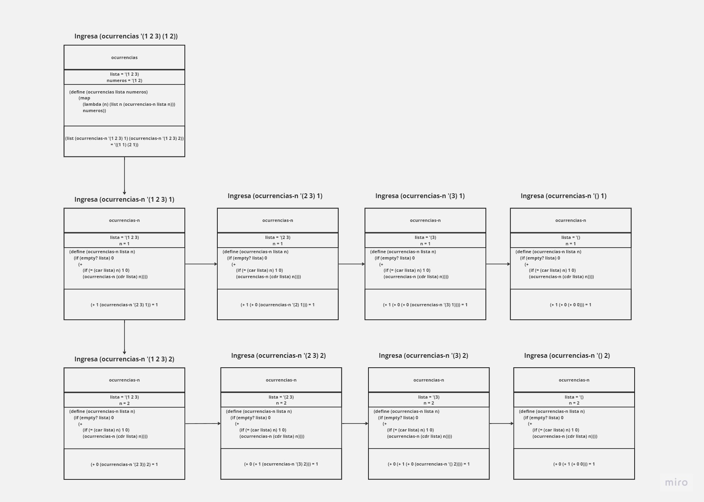
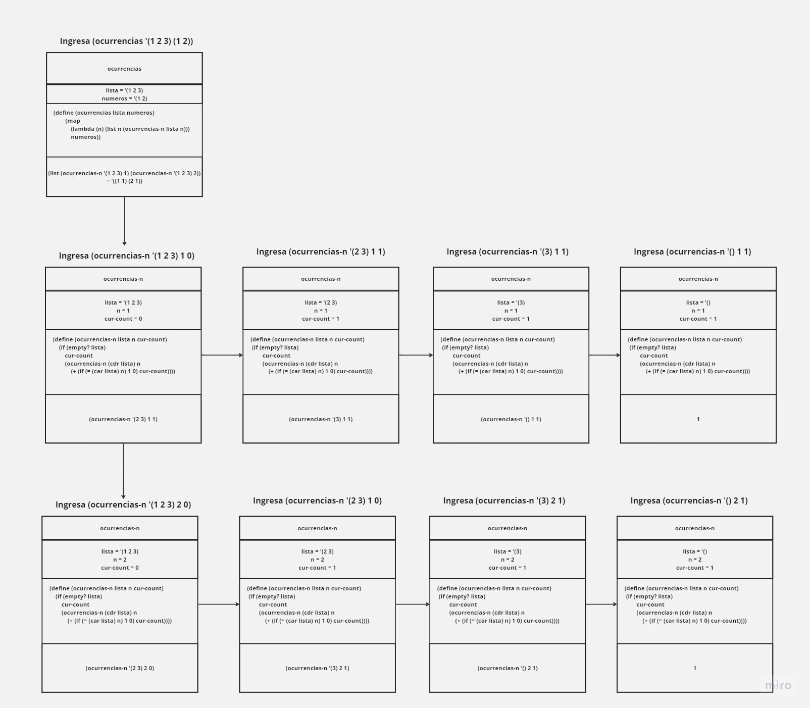

# Lenguajes de Programación - Tarea 5

## Integrantes 
---

<br>

| **Nombre** | **No. de cuenta** |
|---|---|
| *Cureño Sánchez Misael* | 418002485 |
| *González Mancera Ivette* | 316014490 |

<br>

## Instrucciones
---
Resolver los siguientes ejercicios de forma clara y ordenada de acuerdo a los lineamientos de entrega de tareas disponibles en la página del curso.


<br>

## Ejercicios
---

<br>

1. Utiliza el paso de parámetros que se indica para evaluar la siguiente expresión.

    ```
    -------------------------------------------------------
        (0X10)      | {swap {fun {x y} 
                    | 	{with {{ tmp x }}
                    |	    {seqn 
                    |	        {set x y}
                    |		        {set y tmp}}}}}}
    -------------------------------------------------------
        b (0X11)    |         8
    -------------------------------------------------------
        a (0x10)    |         -8
    -------------------------------------------------------
    ```

    Parametros formales: x, y
    Parametros reales: a, b

    -  Paso de parámetros por valor.
    ```ocaml
    {with {
        {a 8}
        {b -8}
        {swap {fun {x y} 
            {with {{ tmp x }}
                {seqn 
                    {set x y}
                    {set y tmp}}}}}
        }
        {seqn 
            {swap a b}
            {- a {+ b a}}}}
    
    ```

    ```scheme
    {with {{ tmp x }} => "tmp" = "x"
    ;; COPIA de valor de a=8
    
    {seqn {set x y} => "x" = "y"
    ;; COPIA del valor b = -8 a "x"     
    
    {set y tmp}=> "y" = "tmp"
    y = 8

    ;; swap hizo el intercambio de valores DENTRO DE LA FUNCIÓN. 
    ;; La segunda expresión de seqn

    {- a {+ b a}}
    = {- 8 {+ -8 8}}
    = {- 8 0}
    = 8
    ```
    
    
    -  Paso de parámetros por referencia.
    
    <br>
    
    ```ocaml
    {with {
        {a 8}
        {b -8}
        {swap {fun {x y} 
            {with {{tmp x}}
                {seqn 
                    {set x y}
                    {set y tmp}}}}}}
        {seqn 
            {swap a b}
            {- a {+ b a}}}}
    ```

    ```scheme 
    {with {{ tmp x }} => "tmp" = "x"
    ;; pasa la REFERENCIA de a = 8

    {seqn {set x y} => "x" = "y"
    ;; pasa la REFERENCIA de b = -8 a "x"
    
    {set y tmp} => "y" = "tmp"
    y = 8

    ;; swap hizo lo suyo: ahora a es b y b es a
    ;; por referencia se pasan las LOCALIDADES DE MEMORIA

    {- a {+ b a }}
    = {- 8 {+ 8 -8}}
    = {- 8 0}
    = -8
    ```

2. Define la función recursiva ocurrencias que recibe dos listas y devuelve una lista de parejas, en donde cada pareja contiene en su parte izquierda un elemento de la segunda lista y en su parte derecha el número de veces que aparece dicho elemento en la primera lista. Por ejemplo:


    ```scheme
    ;; (list, number) -> list
    (define (ocurrencias lista numeros)
        (map (lambda (n) (list n (ocurrencias-n lista n))) numeros))

    ;; (list, number) -> number
    (define (ocurrencias-n lista n)
        (if (empty? lista) 0
            (+ (if (= (car lista) n) 1 0) (ocurrencias-n (cdr lista) n))))

    (ocurrencias '(3 5 8 5 2 1 2 2 0 3) '(2 3 6))
    '((2 3) (3 2) (6 0))
    ```

3. A partir del Ejercicio 2, muestra los registros de activación generados por la función con la siguiente llamada.

    ```scheme
    (ocurrencias '(1 2 3) '(1 2))
    ```

    <center>
    
    </center>


4. Usando recursión de cola optimiza la función del Ejercicio 2. Toda función
auxiliar ocupada debe ser optimizada.

    ```scheme
    ;; (list, number) -> list
    (define (ocurrencias lista numeros)
        (map 
            (lambda (n) (list n (ocurrencias-n lista n 0)))
            numeros))

    ;; (list, number, number) -> list
    (define (ocurrencias-n lista n cur-count)
        (if (empty? lista)
            cur-count
            (ocurrencias-n (cdr lista) n
                (+ (if (= (car lista) n) 1 0) cur-count))))

    (ocurrencias '(3 5 8 5 2 1 2 2 0 3) '(2 3 6))
    '((2 3) (3 2) (6 0))
    ```
    


5. A partir del Ejercicio 4, muestra los registros de activación generados por la función con la siguiente llamada.

    ```scheme
    (ocurrencias '(1 2 3) '(1 2))
    ```
    
    <center>
    
    </center>
