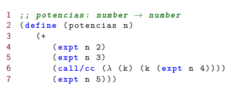
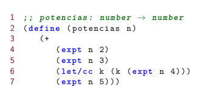
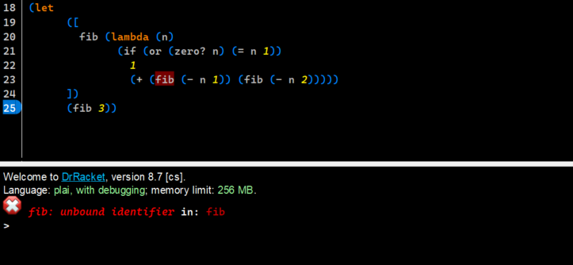
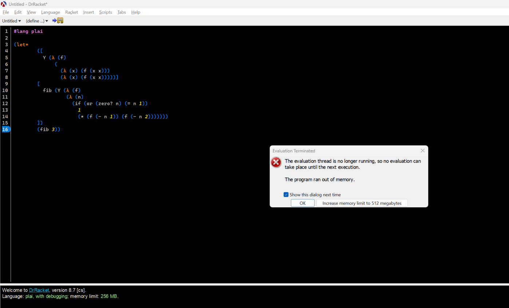

# Lenguajes de Programación - Tarea 6

## Integrantes 
---

<br>

| **Nombre** | **No. de cuenta** |
|---|---|
| *Cureño Sánchez Misael* | 418002485 |
| *González Mancera Ivette* | 316014490 |

<br>

## Instrucciones
---
Resolver los siguientes ejercicios de forma clara y ordenada de acuerdo a los lineamientos de entrega de tareas disponibles en la página del curso.


<br>

## Ejercicios
---

<br>

1. Explica con tus propias palabras el concepto y características de una continuación.

    La continuaciones usan el concepto de materialización de la pila de ejecucion, lo que nos deja pasr como argumentos 
    funciones, esto nos permite volver a un estado anterior o continuar la ejecución de un programa:
    Cuando invocamos una continuación, esta nos envía de regreso al punto en el programa donde se evaluó
    la expresión marcada, la continuación toma un argumento, que remplaza el valor de la expresión marcada
    y la evaluación se reanuda a partir de ahí. 


2. Explica con tus propias palabras el funcionamiento de las primitivas *call/cc* y *let/cc* del
lenguaje de programación *Racket* y da un ejemplo de uso de cada una.

    Lenguajes de programación como Racket, incluyen primitivas para capturar la continuación actual en un punto
    específico de la ejecución de un programa. En Racket, es posible hacer esto mediante las primitivas call/cc
    (call with current continuation) y let/cc (let the current continuation).

    Es decir, call/cc toma una función cuyo parámetro es la continuación actual y puede usarla en su cuerpo para
    obtener algún valor. 

    Tenemos que let/cc hace tres cosas:

    - a) Sirve como la expresión marcada por la continuación.
    - b) Captura la continuación (cc significa *continuación actual*) y la asigna a una variable que designamos.
    - c) Como el let, evalúa cualquier expresión dentro y la última expresión se convierte en el valor de retorno.


   <br>
      <center>
       
      </center>
      <br>

   <br>
      <center>
       
      </center>
      <br>

3. Convierte las siguiente función ultilizando **CPS** (*Continuation Passing Style*) y
muestra su ejecución utilizando el paso de parámetros por valor, con la
instancia entera 5.

    ```scheme
    (define (factorial n)
      (if (= n 0)
        1
        (+ n (factorial (- n 1)))))
    ```

    ### Respuesta:

    ```scheme
    (define (factorial n)
      (factorial-cps n (λ (x) x)))

    (define (factorial-cps n k)
      (if (= n 0)
          (k 1)
          (factorial-cps (- n 1) (λ (x) (* n (k x))))))
    ```

    ```scheme
    (factorial 5)

    (factorial-cps 5 (λ (x) x))

    (factorial-cps
          4 
          (λ (y) (* 5 ((λ (x) x) y))))

    (factorial-cps
          3
          (λ (z) (* 4 ((λ (y) (* 5 ((λ (x) x) y))) z))))


    (factorial-cps
          2
          (λ (a) (* 3 ((λ (z) (* 4 ((λ (y) (* 5 ((λ (x) x) y))) z))) a))))

    (factorial-cps
          1
          (λ (b) (* 2 ((λ (a) (* 3 ((λ (z) (* 4 ((λ (y) (* 5 ((λ (x) x) y))) z))) a))) b))))

    (factorial-cps
          0
          (λ (c) (* 1 ((λ (b) (* 2 ((λ (a) (* 3 ((λ (z) (* 4 ((λ (y) (* 5 ((λ (x) x) y))) z))) a))) b))) c))))

    (* 1 ((λ (b) (* 2 ((λ (a) (* 3 ((λ (z) (* 4 ((λ (y) (* 5 ((λ (x) x) y))) z))) a))) b))) 1))
    (* 1 (* 2 ((λ (a) (* 3 ((λ (z) (* 4 ((λ (y) (* 5 ((λ (x) x) y))) z))) a))) 1)))
    (* 1 (* 2 (* 3 ((λ (z) (* 4 ((λ (y) (* 5 ((λ (x) x) y))) z))) 1))))
    (* 1 (* 2 (* 3 (* 4 ((λ (y) (* 5 ((λ (x) x) y))) 1)))))
    (* 1 (* 2 (* 3 (* 4 (* 5 ((λ (x) x) 1))))))
    (* 1 (* 2 (* 3 (* 4 (* 5 1)))))
    (* 1 (* 2 (* 3 (* 4 5))))
    (* 1 (* 2 (* 3 20)))
    (* 1 (* 2 60))
    (* 1 120)
    120
    ```

4. Observa la siguiente función del lenguaje de programación *Racket*

    ```scheme
    (let 
      ([
        fib (lambda (n)
          (if (or (zero? n) (= n 1))
            1
            (+ (fib (- n 1)) (fib (- n 2)))))
      ])
      (fib 3))
    ```
    
    - Prueba la expresión en el intérprete de *Racket* y con base en la respuesta
    obtenida, explica el proceso que siguió el intérprete para llegar a ésta.
    Anexa una captura de pantalla del intérprete de *Racket* al probar la
    expresión.
    <br>

      1. Primero se tiene que parsear la expresión, para ello, el parser
      crea un *Árbol de Sintaxis Abstracta* que empieza por tener como raiz un let-expression
      luego tiene que parsear los bindings de este let expression y por lo tanto
      itera sobre la lista de bindings parseando uno por uno.

      2. Primero se parsea el identificador que es reconocido como un symbol y
      por lo tanto se le asigna un id.

      3. Después se parsea el valor asociado a ese identificador *fib*.

      4. El parser identifica que se trata de una declaración de una función *lambda*
      con parámetro formal *n*, al parsear el cuerpo de dicha función recursivamente, empezando
      por el if, continuando por el $(num\quad 1)$ y siguiendo por la suma.

      5. El parser parsea la aplicación de función.

      6. Al momento en que se quiere hacer la interpretación el interprete va a 
      recibir el *Árbol de Sintaxis Abstracta*, el stack y el store, va
      a empezar por interpretar el let, para ello tiene que guardar los bindings respectivos
      en el stack y store.

      7. No obstante, cuando se intenta interpretar a fib en la aplicación de función, el inteprete
      arroja un error dado que el stack en ese instante no contiene ningun binding con el identificador
      dado pues el contexto de la función aún no sabe de la existencia de la variable *fib*.
    
    <br>
    <center>
    
    </center>
    <br>

    - Modifica la función usando el **Combinador de Punto Fijo Y**. Prueba la expresión en el intérprete de *Racket* y con base en la respuesta obtenida, explica el proceso que siguió el intérprete para llegar a ésta. Anexa una captura de pantalla del intérprete de *Racket* al probar la expresión.

      ```scheme
      (let*
        ([
          Y (λ (f)
              (
                (λ (x) (f (x x)))
                (λ (x) (f (x x)))))]
        [
          fib (Y (λ (f)
                  (λ (n)
                    (if (or (zero? n) (= n 1))
                      1
                      (* (f (- n 1)) (f (- n 2)))))))
        ])
        (fib 3))
      ```

      ### Respuesta:

      ```scheme
      (((λ (f)
              (
                (λ (x) (f (x x)))
                (λ (x) (f (x x)))))
        fib) 3)

      (((λ (f) (
                (λ (x) (f (x x)))
                (λ (x) (f (x x)))))
        fib) 3)

      ((
        (λ (x) (fib (x x)))
        (λ (x) (fib (x x)))))
        3)

      (
        (fib
          (
            (λ (x) (fib (x x))))
            (λ (x) (fib (x x))))
          )
        )
        3)

      (
        (fib
          (
            (λ (x) (fib (x x))))
            (λ (x) (fib (x x))))
          )
        )
        3)

      ((fib (Y fib)) 3)
      
      ;; Pero (Y fib) es la primera aplicación que hicimos, de modo que
      ;; las llamadas se siguen acumulando en el stack y por ello racket no
      ;; termina la ejecución pues siempre está tratando de evaluar las
      ;; expresiones de manera ansiosa.
      ```

      <br>
      <center>
      
      </center>
      <br>
